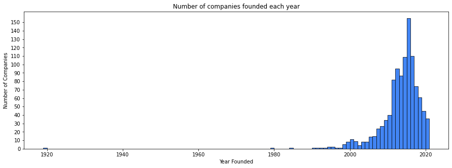
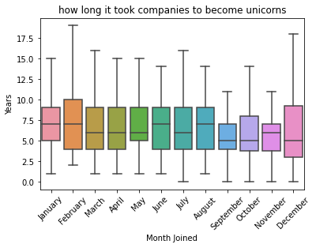
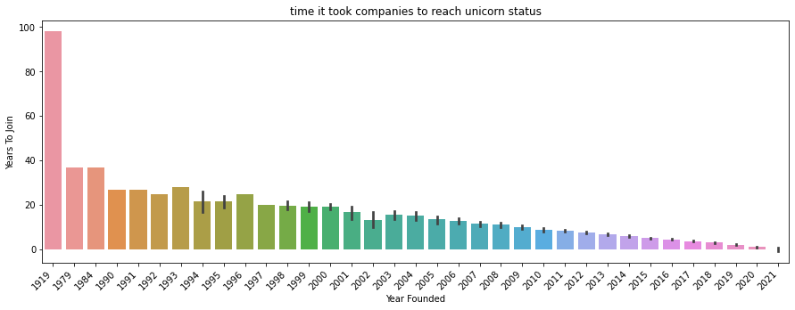
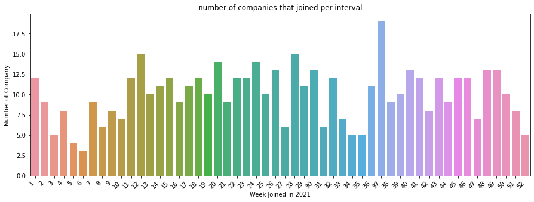
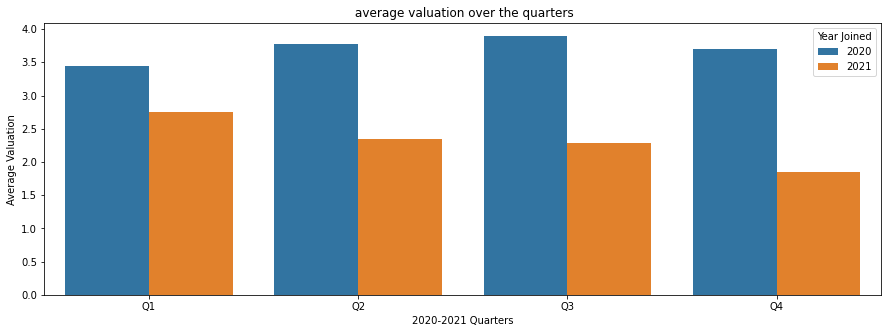

# Activity: Structure your data 

## Introduction

In this activity, you will practice structuring, an **exploratory data analysis (EDA)** step that helps data science projects move forward. During EDA, when working with data that contains aspects of date and time, "datetime" transformations are integral to better understanding the data. As a data professional, you will encounter datetime transformations quite often as you determine how to format your data to suit the problems you want to solve or the questions you want to answer. This activity gives you an opportunity to apply these skills and prepare you for future EDA, where you will need to determine how best to structure your data.

In this activity, you are a member of an analytics team that provides insights to an investing firm. To help them decide which companies to invest in next, the firm wants insights into **unicorn companies**–companies that are valued at over one billion dollars.  

You will work with a dataset about unicorn companies, discovering characteristics of the data, structuring the data in ways that will help you draw meaningful insights, and using visualizations to analyze the data. Ultimately, you will draw conclusions about what significant trends or patterns you find in the dataset. This will develop your skills in EDA and your knowledge of functions that allow you to structure data.


## Step 1: Imports 

### Import relevant libraries and modules

Import the relevant Python libraries and modules that you will need to use. In this activity, you will use `pandas`, `numpy`, `seaborn`, and `matplotlib.pyplot`.


```python
# Import the relevant Python libraries and modules needed in this lab.

### YOUR CODE HERE ###
import pandas as pd
import numpy as np
import seaborn as sns
import matplotlib.pyplot as plt
```

### Load the dataset into a DataFrame

The dataset provided is in the form of a csv file named `Unicorn_Companies.csv` and contains a subset of data on unicorn companies. As shown in this cell, the dataset has been automatically loaded in for you. You do not need to download the .csv file, or provide more code, in order to access the dataset and proceed with this lab. Please continue with this activity by completing the following instructions.


```python
# RUN THIS CELL TO IMPORT YOUR DATA.

### YOUR CODE HERE ###
companies = pd.read_csv("Unicorn_Companies.csv")
```

## Step 2: Data exploration


### Display the first 10 rows of the data

In this section, you will discover what the dataset entails and answer questions to guide your exploration and analysis of the data. This is an important step in EDA. 

To begin, display the first 10 rows of the data to get an understanding of how the dataset is structured. 


```python
# Display the first 10 rows of the data.

### YOUR CODE HERE ###
companies.head(10)

```


<div>
<style scoped>
    .dataframe tbody tr th:only-of-type {
        vertical-align: middle;
    }

    .dataframe tbody tr th {
        vertical-align: top;
    }

    .dataframe thead th {
        text-align: right;
    }
</style>
<table border="1" class="dataframe">
  <thead>
    <tr style="text-align: right;">
      <th></th>
      <th>Company</th>
      <th>Valuation</th>
      <th>Date Joined</th>
      <th>Industry</th>
      <th>City</th>
      <th>Country/Region</th>
      <th>Continent</th>
      <th>Year Founded</th>
      <th>Funding</th>
      <th>Select Investors</th>
    </tr>
  </thead>
  <tbody>
    <tr>
      <th>0</th>
      <td>Bytedance</td>
      <td>$180B</td>
      <td>4/7/17</td>
      <td>Artificial intelligence</td>
      <td>Beijing</td>
      <td>China</td>
      <td>Asia</td>
      <td>2012</td>
      <td>$8B</td>
      <td>Sequoia Capital China, SIG Asia Investments, S...</td>
    </tr>
    <tr>
      <th>1</th>
      <td>SpaceX</td>
      <td>$100B</td>
      <td>12/1/12</td>
      <td>Other</td>
      <td>Hawthorne</td>
      <td>United States</td>
      <td>North America</td>
      <td>2002</td>
      <td>$7B</td>
      <td>Founders Fund, Draper Fisher Jurvetson, Rothen...</td>
    </tr>
    <tr>
      <th>2</th>
      <td>SHEIN</td>
      <td>$100B</td>
      <td>7/3/18</td>
      <td>E-commerce &amp; direct-to-consumer</td>
      <td>Shenzhen</td>
      <td>China</td>
      <td>Asia</td>
      <td>2008</td>
      <td>$2B</td>
      <td>Tiger Global Management, Sequoia Capital China...</td>
    </tr>
    <tr>
      <th>3</th>
      <td>Stripe</td>
      <td>$95B</td>
      <td>1/23/14</td>
      <td>Fintech</td>
      <td>San Francisco</td>
      <td>United States</td>
      <td>North America</td>
      <td>2010</td>
      <td>$2B</td>
      <td>Khosla Ventures, LowercaseCapital, capitalG</td>
    </tr>
    <tr>
      <th>4</th>
      <td>Klarna</td>
      <td>$46B</td>
      <td>12/12/11</td>
      <td>Fintech</td>
      <td>Stockholm</td>
      <td>Sweden</td>
      <td>Europe</td>
      <td>2005</td>
      <td>$4B</td>
      <td>Institutional Venture Partners, Sequoia Capita...</td>
    </tr>
    <tr>
      <th>5</th>
      <td>Canva</td>
      <td>$40B</td>
      <td>1/8/18</td>
      <td>Internet software &amp; services</td>
      <td>Surry Hills</td>
      <td>Australia</td>
      <td>Oceania</td>
      <td>2012</td>
      <td>$572M</td>
      <td>Sequoia Capital China, Blackbird Ventures, Mat...</td>
    </tr>
    <tr>
      <th>6</th>
      <td>Checkout.com</td>
      <td>$40B</td>
      <td>5/2/19</td>
      <td>Fintech</td>
      <td>London</td>
      <td>United Kingdom</td>
      <td>Europe</td>
      <td>2012</td>
      <td>$2B</td>
      <td>Tiger Global Management, Insight Partners, DST...</td>
    </tr>
    <tr>
      <th>7</th>
      <td>Instacart</td>
      <td>$39B</td>
      <td>12/30/14</td>
      <td>Supply chain, logistics, &amp; delivery</td>
      <td>San Francisco</td>
      <td>United States</td>
      <td>North America</td>
      <td>2012</td>
      <td>$3B</td>
      <td>Khosla Ventures, Kleiner Perkins Caufield &amp; By...</td>
    </tr>
    <tr>
      <th>8</th>
      <td>JUUL Labs</td>
      <td>$38B</td>
      <td>12/20/17</td>
      <td>Consumer &amp; retail</td>
      <td>San Francisco</td>
      <td>United States</td>
      <td>North America</td>
      <td>2015</td>
      <td>$14B</td>
      <td>Tiger Global Management</td>
    </tr>
    <tr>
      <th>9</th>
      <td>Databricks</td>
      <td>$38B</td>
      <td>2/5/19</td>
      <td>Data management &amp; analytics</td>
      <td>San Francisco</td>
      <td>United States</td>
      <td>North America</td>
      <td>2013</td>
      <td>$3B</td>
      <td>Andreessen Horowitz, New Enterprise Associates...</td>
    </tr>
  </tbody>
</table>
</div>


<details>
  <summary><h4><strong>Hint 1</strong></h4></summary>

Refer to [the content about exploratory data analysis in Python](https://www.coursera.org/learn/go-beyond-the-numbers-translate-data-into-insight/lecture/kfl9b/find-stories-using-the-six-exploratory-data-analysis-practices).

</details>

<details>
  <summary><h4><strong>Hint 2</strong></h4></summary>

Use the function in the `pandas` library that allows you to get a specific number of rows from the top of a DataFrame.
 

</details>

<details>
  <summary><h4><strong>Hint 3</strong></h4></summary>

  Call the `head()` function from the `pandas` library and pass in the number of rows you want from the top of the DataFrame.

</details>

### Identify the number of rows and columns

Identify the number of rows and columns in the dataset. This will help you get a sense of how much data you are working with.


```python
# Identify the number of rows and columns in the dataset.

### YOUR CODE HERE ###
companies.shape

```


    (1074, 10)


<details>
  <summary><h4><strong>Hint 1</strong></h4></summary>

Refer to [the content about exploratory data analysis in Python](https://www.coursera.org/learn/go-beyond-the-numbers-translate-data-into-insight/lecture/kfl9b/find-stories-using-the-six-exploratory-data-analysis-practices).

</details>

<details>
  <summary><h4><strong>Hint 2</strong></h4></summary>

Use the property that DataFrames in `pandas` have to display the number of rows and the number of columns as a tuple.
 

</details>

<details>
  <summary><h4><strong>Hint 3</strong></h4></summary>

The `shape` property that DataFrames have can help.

</details>

**Question:** How many rows and columns are in the dataset? How many unicorn companies are there? How many aspects are shown for each company?


[Write your response here. Double-click (or enter) to edit.] 1074 rows means there are 1074 companies, 10 columns means 10 different aspects for each company.

### Check for duplicates in the data


```python
# Check for duplicates.

### YOUR CODE HERE ###
companies.drop_duplicates().shape
```


    (1074, 10)


<details>
  <summary><h4><strong>Hint 1</strong></h4></summary>

Refer to [the content about exploratory data analysis in Python](https://www.coursera.org/learn/go-beyond-the-numbers-translate-data-into-insight/lecture/kfl9b/find-stories-using-the-six-exploratory-data-analysis-practices).

</details>

<details>
  <summary><h4><strong>Hint 2</strong></h4></summary>

Use the function in `pandas` that can be called on a DataFrame to return the same DataFrame but with duplicates removed.

Use property that DataFrames in `pandas` have that to display the number of rows and columns as a tuple.
 
</details>

<details>
  <summary><h4><strong>Hint 3</strong></h4></summary>

Call the `drop_duplicates()` function on `companies`, followed by calling the `shape` property. 

Compare the shape that is returned from this to the original shape of `companies`, which you identified previously. 

</details>

**Question:** Based on the preceding output, are there any duplicates in the dataset?


[Write your response here. Double-click (or enter) to edit.]There is no duplicate in the dataframe.

### Display the data types of the columns 

Knowing the data types of the columns is helpful because it indicates what types of analysis and aggregation can be done, how a column can be transformed to suit specific tasks, and so on. Display the data types of the columns. 


```python
# Display the data types of the columns.

### YOUR CODE HERE ###

companies.info()
```

    <class 'pandas.core.frame.DataFrame'>
    RangeIndex: 1074 entries, 0 to 1073
    Data columns (total 10 columns):
     #   Column            Non-Null Count  Dtype 
    ---  ------            --------------  ----- 
     0   Company           1074 non-null   object
     1   Valuation         1074 non-null   object
     2   Date Joined       1074 non-null   object
     3   Industry          1074 non-null   object
     4   City              1058 non-null   object
     5   Country/Region    1074 non-null   object
     6   Continent         1074 non-null   object
     7   Year Founded      1074 non-null   int64 
     8   Funding           1074 non-null   object
     9   Select Investors  1073 non-null   object
    dtypes: int64(1), object(9)
    memory usage: 84.0+ KB


<details>
  <summary><h4><strong>Hint 1</strong></h4></summary>

Refer to [the content about exploratory data analysis in Python](https://www.coursera.org/learn/go-beyond-the-numbers-translate-data-into-insight/lecture/kfl9b/find-stories-using-the-six-exploratory-data-analysis-practices).

</details>

<details>
  <summary><h4><strong>Hint 2</strong></h4></summary>

Use the property that DataFrames in `pandas` have to display the data types of the columns in the specified DataFrame.
 

</details>

<details>
  <summary><h4><strong>Hint 3</strong></h4></summary>

The `dtypes` property that DataFrames have can help.

</details>

**Question:** What do you notice about the data types of the columns in the dataset?


[Write your response here. Double-click (or enter) to edit.] Only "Year Founded" value type is int, others are all string.

**Question:** How would you sort this dataset in order to get insights about when the companies were founded? Then, how would you arrange the data from companies that were founded the earliest to companies that were founded the latest?


[Write your response here. Double-click (or enter) to edit.] We can sort the "year founded" to find the earliest or the latest.

### Sort the data

In this section, you will continue your exploratory data analysis by structuring the data. This is an important step in EDA, as it allows you to glean valuable and interesting insights about the data afterwards.

To begin, sort the data so that you can get insights about when the companies were founded. Consider whether it would make sense to sort in ascending or descending order based on what you would like to find.


```python
# Sort `companies` and display the first 10 rows of the resulting DataFrame.

### YOUR CODE HERE ###

companies_sort = companies.sort_values(['Year Founded'],ascending = True)
companies_sort.head(10)
```


<div>
<style scoped>
    .dataframe tbody tr th:only-of-type {
        vertical-align: middle;
    }

    .dataframe tbody tr th {
        vertical-align: top;
    }

    .dataframe thead th {
        text-align: right;
    }
</style>
<table border="1" class="dataframe">
  <thead>
    <tr style="text-align: right;">
      <th></th>
      <th>Company</th>
      <th>Valuation</th>
      <th>Date Joined</th>
      <th>Industry</th>
      <th>City</th>
      <th>Country/Region</th>
      <th>Continent</th>
      <th>Year Founded</th>
      <th>Funding</th>
      <th>Select Investors</th>
    </tr>
  </thead>
  <tbody>
    <tr>
      <th>189</th>
      <td>Otto Bock HealthCare</td>
      <td>$4B</td>
      <td>6/24/17</td>
      <td>Health</td>
      <td>Duderstadt</td>
      <td>Germany</td>
      <td>Europe</td>
      <td>1919</td>
      <td>$0M</td>
      <td>EQT Partners</td>
    </tr>
    <tr>
      <th>373</th>
      <td>Promasidor Holdings</td>
      <td>$2B</td>
      <td>11/8/16</td>
      <td>Consumer &amp; retail</td>
      <td>Bryanston</td>
      <td>South Africa</td>
      <td>Asia</td>
      <td>1979</td>
      <td>$556M</td>
      <td>IFC, Ajinomoto</td>
    </tr>
    <tr>
      <th>699</th>
      <td>Five Star Business Finance</td>
      <td>$1B</td>
      <td>3/26/21</td>
      <td>Other</td>
      <td>Chennai</td>
      <td>India</td>
      <td>Asia</td>
      <td>1984</td>
      <td>$456M</td>
      <td>Sequoia Capital India, Tiger Global Management...</td>
    </tr>
    <tr>
      <th>840</th>
      <td>Radius Payment Solutions</td>
      <td>$1B</td>
      <td>11/27/17</td>
      <td>Fintech</td>
      <td>Crewe</td>
      <td>United Kingdom</td>
      <td>Europe</td>
      <td>1990</td>
      <td>$200M</td>
      <td>Inflexion Private Equity</td>
    </tr>
    <tr>
      <th>11</th>
      <td>Epic Games</td>
      <td>$32B</td>
      <td>10/26/18</td>
      <td>Other</td>
      <td>Cary</td>
      <td>United States</td>
      <td>North America</td>
      <td>1991</td>
      <td>$7B</td>
      <td>Tencent Holdings, KKR, Smash Ventures</td>
    </tr>
    <tr>
      <th>377</th>
      <td>BGL Group</td>
      <td>$2B</td>
      <td>11/24/17</td>
      <td>Fintech</td>
      <td>Peterborough</td>
      <td>United Kingdom</td>
      <td>Europe</td>
      <td>1992</td>
      <td>$696M</td>
      <td>CPP Investment Board</td>
    </tr>
    <tr>
      <th>1043</th>
      <td>Thirty Madison</td>
      <td>$1B</td>
      <td>6/2/21</td>
      <td>Health</td>
      <td>New York</td>
      <td>United States</td>
      <td>North America</td>
      <td>1993</td>
      <td>$210M</td>
      <td>Northzone Ventures, Maveron, Johnson &amp; Johnson...</td>
    </tr>
    <tr>
      <th>129</th>
      <td>Howden Group Holdings</td>
      <td>$5B</td>
      <td>9/29/20</td>
      <td>Other</td>
      <td>London</td>
      <td>United Kingdom</td>
      <td>Europe</td>
      <td>1994</td>
      <td>$187M</td>
      <td>General Atlantic, 3i Group, Huagai Capital</td>
    </tr>
    <tr>
      <th>118</th>
      <td>Vice Media</td>
      <td>$6B</td>
      <td>4/2/11</td>
      <td>Internet software &amp; services</td>
      <td>Brooklyn</td>
      <td>United States</td>
      <td>North America</td>
      <td>1994</td>
      <td>$1B</td>
      <td>Technology Crossover Ventures, A&amp;E Television ...</td>
    </tr>
    <tr>
      <th>360</th>
      <td>Carzone</td>
      <td>$2B</td>
      <td>3/1/19</td>
      <td>E-commerce &amp; direct-to-consumer</td>
      <td>Jiangsu</td>
      <td>China</td>
      <td>Asia</td>
      <td>1995</td>
      <td>$946M</td>
      <td>Alibaba Group,Co-Stone Venture Capital, Buhuo ...</td>
    </tr>
  </tbody>
</table>
</div>


<details>
  <summary><h4><strong>Hint 1</strong></h4></summary>

Refer to [the content about exploratory data analysis in Python](https://www.coursera.org/learn/go-beyond-the-numbers-translate-data-into-insight/lecture/kfl9b/find-stories-using-the-six-exploratory-data-analysis-practices).

</details>

<details>
  <summary><h4><strong>Hint 2</strong></h4></summary>

Use the function in `pandas` that allows you to sort a DataFrame along a specific column.

</details>

<details>
  <summary><h4><strong>Hint 3</strong></h4></summary>

Use the `sort_values()` function, specifying the `by` parameter as the name of the column that you want to sort by and the `ascending` parameter as needed. Note that by default, `ascending` is set to `True`. If you want to sort in descending order, specify the `ascending` parameter as `False`.

</details>

**Question:** What do you observe from the sorting that you performed?


[Write your response here. Double-click (or enter) to edit.] The earliest year is 1919 and the latest year is 2021.

**Question:** Which library would you use to get the count of each distinct value in the `Year Founded` column? 


[Write your response here. Double-click (or enter) to edit.] Pandas

### Determine the number of companies founded each year

Find out how many companies in this dataset were founded each year. Make sure to display each unique `Year Founded` that occurs in the dataset, and for each year, a number that represents how many companies were founded then.


```python
# Display each unique year that occurs in the dataset
# along with the number of companies that were founded in each unique year.

### YOUR CODE HERE ###
companies['Year Founded'].value_counts().sort_index()
```


    1919      1
    1979      1
    1984      1
    1990      1
    1991      1
    1992      1
    1993      1
    1994      2
    1995      2
    1996      1
    1997      1
    1998      5
    1999      8
    2000     11
    2001      9
    2002      4
    2003      8
    2004      8
    2005     14
    2006     15
    2007     24
    2008     27
    2009     34
    2010     40
    2011     82
    2012     95
    2013     87
    2014    109
    2015    155
    2016    110
    2017     74
    2018     61
    2019     45
    2020     25
    2021     11
    Name: Year Founded, dtype: int64


<details>
  <summary><h4><strong>Hint 1</strong></h4></summary>

Refer to [the content about exploratory data analysis in Python](https://www.coursera.org/learn/go-beyond-the-numbers-translate-data-into-insight/lecture/kfl9b/find-stories-using-the-six-exploratory-data-analysis-practices).

</details>

<details>
  <summary><h4><strong>Hint 2</strong></h4></summary>

Use the function in `pandas` that allows you to get the count for each distinct value in a specific column.

</details>

<details>
  <summary><h4><strong>Hint 3</strong></h4></summary>

Use the `value_counts()` function on the `Year Founded` column. 

</details>

**Question:** What do you observe from the counts of the unique `Year Founded` values in the dataset?


[Write your response here. Double-click (or enter) to edit.] From 2014 to 2016, have the most company founded number.

**Question:** What kind of graph represents the counts of samples based on a particular feature?


[Write your response here. Double-click (or enter) to edit.] Bar chart

Plot a histogram of the `Year Founded` feature.


```python
# Plot a histogram of the Year Founded feature.
### YOUR CODE HERE ###
plt.figure(figsize=(15, 5))
g = sns.histplot(companies['Year Founded'], binrange=(1919,2021), binwidth=1, color='#4285F4', alpha=1)
g.set_yticks(range(0, 155, 10))
plt.ylabel('Number of Companies')
plt.title('Number of companies founded each year')
plt.show();
```





**Question:** If you want to compare when one company joined unicorn status to when another company joined, how would you transform the `Date Joined` column to gain that insight? To answer this question, notice the data types.


[Write your response here. Double-click (or enter) to edit.]First we need change the "date joined" type to datetime. Then we can extract the year/month/day values and make comparation.

### Convert the `Date Joined` column to datetime

Convert the `Date Joined` column to datetime. This will split each value into year, month, and date components, allowing you to later gain insights about when a company gained unicorn status with respect to each component.


```python
# Convert the `Date Joined` column to datetime.
# Update the column with the converted values.

### YOUR CODE HERE ###

companies['Date Joined'] = pd.to_datetime(companies['Date Joined'])


# Display the data types of the columns in `companies`
# to confirm that the update actually took place.

### YOUR CODE HERE ###

companies.info()
```

    <class 'pandas.core.frame.DataFrame'>
    RangeIndex: 1074 entries, 0 to 1073
    Data columns (total 10 columns):
     #   Column            Non-Null Count  Dtype         
    ---  ------            --------------  -----         
     0   Company           1074 non-null   object        
     1   Valuation         1074 non-null   object        
     2   Date Joined       1074 non-null   datetime64[ns]
     3   Industry          1074 non-null   object        
     4   City              1058 non-null   object        
     5   Country/Region    1074 non-null   object        
     6   Continent         1074 non-null   object        
     7   Year Founded      1074 non-null   int64         
     8   Funding           1074 non-null   object        
     9   Select Investors  1073 non-null   object        
    dtypes: datetime64[ns](1), int64(1), object(8)
    memory usage: 84.0+ KB


<details>
  <summary><h4><strong>Hint 1</strong></h4></summary>

Refer to [the content about datetime transformations in Python](https://www.coursera.org/learn/go-beyond-the-numbers-translate-data-into-insight/supplement/ZcM4z/reference-guide-datetime-manipulation).

</details>

<details>
  <summary><h4><strong>Hint 2</strong></h4></summary>

Use the function in `pandas` that allows you to convert an object to datetime format.

Use the property that DataFrames have that can be used to display the data types of the columns.

</details>

<details>
  <summary><h4><strong>Hint 3</strong></h4></summary>

Use the `to_datetime()` function on the `Date Joined` column.

Make sure to update the column by reassigning to the result of the function call mentioned previously.

Use the `dtypes` property to get the data types of the columns in `companies`.

</details>

**Question:** How would you obtain the names of the months when companies gained unicorn status?


[Write your response here. Double-click (or enter) to edit.]use code: .dt.month_name() in lib pandas.

### Create a `Month Joined` column

Obtain the names of the months when companies gained unicorn status, and use the result to create a `Month Joined` column. 


```python
# Obtain the names of the months when companies gained unicorn status.
# Use the result to create a `Month Joined` column.

### YOUR CODE HERE ###
companies['Month Joined'] = companies['Date Joined'].dt.month_name()


# Display the first few rows of `companies`
# to confirm that the new column did get added.

### YOUR CODE HERE ###

companies.head()
```


<div>
<style scoped>
    .dataframe tbody tr th:only-of-type {
        vertical-align: middle;
    }

    .dataframe tbody tr th {
        vertical-align: top;
    }

    .dataframe thead th {
        text-align: right;
    }
</style>
<table border="1" class="dataframe">
  <thead>
    <tr style="text-align: right;">
      <th></th>
      <th>Company</th>
      <th>Valuation</th>
      <th>Date Joined</th>
      <th>Industry</th>
      <th>City</th>
      <th>Country/Region</th>
      <th>Continent</th>
      <th>Year Founded</th>
      <th>Funding</th>
      <th>Select Investors</th>
      <th>Month Joined</th>
    </tr>
  </thead>
  <tbody>
    <tr>
      <th>0</th>
      <td>Bytedance</td>
      <td>$180B</td>
      <td>2017-04-07</td>
      <td>Artificial intelligence</td>
      <td>Beijing</td>
      <td>China</td>
      <td>Asia</td>
      <td>2012</td>
      <td>$8B</td>
      <td>Sequoia Capital China, SIG Asia Investments, S...</td>
      <td>April</td>
    </tr>
    <tr>
      <th>1</th>
      <td>SpaceX</td>
      <td>$100B</td>
      <td>2012-12-01</td>
      <td>Other</td>
      <td>Hawthorne</td>
      <td>United States</td>
      <td>North America</td>
      <td>2002</td>
      <td>$7B</td>
      <td>Founders Fund, Draper Fisher Jurvetson, Rothen...</td>
      <td>December</td>
    </tr>
    <tr>
      <th>2</th>
      <td>SHEIN</td>
      <td>$100B</td>
      <td>2018-07-03</td>
      <td>E-commerce &amp; direct-to-consumer</td>
      <td>Shenzhen</td>
      <td>China</td>
      <td>Asia</td>
      <td>2008</td>
      <td>$2B</td>
      <td>Tiger Global Management, Sequoia Capital China...</td>
      <td>July</td>
    </tr>
    <tr>
      <th>3</th>
      <td>Stripe</td>
      <td>$95B</td>
      <td>2014-01-23</td>
      <td>Fintech</td>
      <td>San Francisco</td>
      <td>United States</td>
      <td>North America</td>
      <td>2010</td>
      <td>$2B</td>
      <td>Khosla Ventures, LowercaseCapital, capitalG</td>
      <td>January</td>
    </tr>
    <tr>
      <th>4</th>
      <td>Klarna</td>
      <td>$46B</td>
      <td>2011-12-12</td>
      <td>Fintech</td>
      <td>Stockholm</td>
      <td>Sweden</td>
      <td>Europe</td>
      <td>2005</td>
      <td>$4B</td>
      <td>Institutional Venture Partners, Sequoia Capita...</td>
      <td>December</td>
    </tr>
  </tbody>
</table>
</div>


<details>
  <summary><h4><strong>Hint 1</strong></h4></summary>

Refer to [the content about extracting components from datetime objects in Python](https://www.coursera.org/learn/go-beyond-the-numbers-translate-data-into-insight/lecture/Vh13u/use-structuring-methods-to-establish-order-in-your-dataset).

</details>

<details>
  <summary><h4><strong>Hint 2</strong></h4></summary>

Use the function in the `pandas` library that contains datetime strings in order to extract the month names.

Use the function in the `pandas` library that allows you to display the first few rows of a DataFrame.

</details>

<details>
  <summary><h4><strong>Hint 3</strong></h4></summary>

Use the `dt.month_name()` function on the `Date Joined` column.

Use a pair of square brackets to create a new column. Make sure to specify the name of the new column inside the brackets and assign the column to the result of calling the function mentioned previously.

Use the `head()` function to display the first few rows of a DataFrame.

</details>

**Question:** Using the 'Date Joined' column, how would you determine how many years it took for companies to reach unicorn status?


[Write your response here. Double-click (or enter) to edit.] Extract year value from "date joined" and substract the Year founded.

### Create a `Years To Join` column

Determine how many years it took for companies to reach unicorn status, and use the result to create a `Years To Join` column. Adding this to the dataset can help you answer questions you may have about this aspect of the companies.


```python
# Determine how many years it took for companies to reach unicorn status.
# Use the result to create a `Years To Join` column.

### YOUR CODE HERE ###
companies['Years To Join'] = companies['Date Joined'].dt.year - companies['Year Founded']


# Display the first few rows of `companies`
# to confirm that the new column did get added.

### YOUR CODE HERE ###

companies.info()
```

    <class 'pandas.core.frame.DataFrame'>
    RangeIndex: 1074 entries, 0 to 1073
    Data columns (total 12 columns):
     #   Column            Non-Null Count  Dtype         
    ---  ------            --------------  -----         
     0   Company           1074 non-null   object        
     1   Valuation         1074 non-null   object        
     2   Date Joined       1074 non-null   datetime64[ns]
     3   Industry          1074 non-null   object        
     4   City              1058 non-null   object        
     5   Country/Region    1074 non-null   object        
     6   Continent         1074 non-null   object        
     7   Year Founded      1074 non-null   int64         
     8   Funding           1074 non-null   object        
     9   Select Investors  1073 non-null   object        
     10  Month Joined      1074 non-null   object        
     11  Years To Join     1074 non-null   int64         
    dtypes: datetime64[ns](1), int64(2), object(9)
    memory usage: 100.8+ KB


<details>
  <summary><h4><strong>Hint 1</strong></h4></summary>

Refer to [the content about extracting components from datetime objects in Python](https://www.coursera.org/learn/go-beyond-the-numbers-translate-data-into-insight/lecture/Vh13u/use-structuring-methods-to-establish-order-in-your-dataset).

</details>

<details>
  <summary><h4><strong>Hint 2</strong></h4></summary>

Use the property in the `pandas` library that contains datetime strings in order to extract the year components.

Use the function in the `pandas` library that allows you to display the first few rows of a DataFrame.

</details>

<details>
  <summary><h4><strong>Hint 3</strong></h4></summary>

Use the `dt.year` property on the `Date Joined` column to obtain the years that companies became unicorns.

Obtain the arithmetic difference elementwise between two series in `pandas` by using the subtraction operator.  

Use a pair of square brackets to create a new column. Make sure to specify the name of the new column inside the brackets and assign the column to the result of calling the function mentioned previously.

Use the `head()` function can to display the first few rows of a DataFrame.

</details>

**Question:** Which year would you like to gain more insight on with respect when companies attained unicorn status, and why?


[Write your response here. Double-click (or enter) to edit.]Get more insight on the year 2021, as that is the most recent year for which there is data available. Trends that took place in 2021 might be similar to trends that will take place in 2022.

### Gain more insight on a specific year

To gain more insight on the year of that interests you, filter the dataset by that year and save the resulting subset into a new variable. 


```python
# Filter dataset by a year of your interest (in terms of when companies reached unicorn status).
# Save the resulting subset in a new variable. 

### YOUR CODE HERE ###

companies_2021 = companies[companies['Date Joined'].dt.year == 2021]


# Display the first few rows of the subset to confirm that it was created.

### YOUR CODE HERE ###

companies_2021.info()
```

    <class 'pandas.core.frame.DataFrame'>
    Int64Index: 520 entries, 12 to 1072
    Data columns (total 12 columns):
     #   Column            Non-Null Count  Dtype         
    ---  ------            --------------  -----         
     0   Company           520 non-null    object        
     1   Valuation         520 non-null    object        
     2   Date Joined       520 non-null    datetime64[ns]
     3   Industry          520 non-null    object        
     4   City              507 non-null    object        
     5   Country/Region    520 non-null    object        
     6   Continent         520 non-null    object        
     7   Year Founded      520 non-null    int64         
     8   Funding           520 non-null    object        
     9   Select Investors  520 non-null    object        
     10  Month Joined      520 non-null    object        
     11  Years To Join     520 non-null    int64         
    dtypes: datetime64[ns](1), int64(2), object(9)
    memory usage: 52.8+ KB


<details>
  <summary><h4><strong>Hint 1</strong></h4></summary>

Refer to [the content about structuring data in Python](https://www.coursera.org/learn/go-beyond-the-numbers-translate-data-into-insight/lecture/Vh13u/use-structuring-methods-to-establish-order-in-your-dataset).

</details>

<details>
  <summary><h4><strong>Hint 2</strong></h4></summary>

Use the property in the `pandas` library that contains datetime strings in order to extract the year components.

Use square brackets to filter a DataFrame in order get a subset of the data. Make sure to specify an appropriate condition inside those brackets. The condition should convey which year you want to filter by. The rows that meet the condition are the rows that will be selected.

Use the function in the `pandas` library that allows you to display the first few rows of a DataFrame.

</details>

<details>
  <summary><h4><strong>Hint 3</strong></h4></summary>

Use the `dt.year` property on the `Date Joined` column to obtain the years that companies became unicorns.

Make sure to create a new variable and assign it to the subset. 

Use the `head()` function to display the first few rows of a DataFrame.

</details>

**Question:** Using a time interval, how could you observe trends in the companies that became unicorns in one year?


[Write your response here. Double-click (or enter) to edit.] identify a time interval of your choice. Then, take the subset that consists of the data for the year of interest, create a column that contains the time interval that each data point belongs to (as needed), group by that column, and count the number of companies that joined per interval.

### Observe trends over time

Implement the structuring approach that you have identified to observe trends over time in the companies that became unicorns for the year that interests you.


```python
# After identifying the time interval that interests you, proceed with the following:
# Step 1. Take the subset that you defined for the year of interest. 
#         Insert a column that contains the time interval that each data point belongs to, as needed.
# Step 2. Group by the time interval.
#         Aggregate by counting companies that joined per interval of that year.
#         Save the resulting DataFrame in a new variable.

### YOUR CODE HERE ###

companies_2021['Week Joined'] = companies_2021['Date Joined'].dt.week
companies_2021_grouped = companies_2021.groupby('Week Joined').agg(Number_of_Company = pd.NamedAgg(column = 'Company', aggfunc = 'count')).reset_index()


# Display the first few rows of the new DataFrame to confirm that it was created

### YOUR CODE HERE ###

companies_2021_grouped.info()

```

    <class 'pandas.core.frame.DataFrame'>
    RangeIndex: 52 entries, 0 to 51
    Data columns (total 2 columns):
     #   Column             Non-Null Count  Dtype
    ---  ------             --------------  -----
     0   Week Joined        52 non-null     int64
     1   Number_of_Company  52 non-null     int64
    dtypes: int64(2)
    memory usage: 960.0 bytes


<details>
  <summary><h4><strong>Hint 1</strong></h4></summary>

Refer to [the content about structuring data in Python](https://www.coursera.org/learn/go-beyond-the-numbers-translate-data-into-insight/lecture/Vh13u/use-structuring-methods-to-establish-order-in-your-dataset).

</details>

<details>
  <summary><h4><strong>Hint 2</strong></h4></summary>

To obtain the data in a specific periodic datetime format, call a function in the `pandas` library on a series that contains datetime strings.   

Keep in mind that currently, the `Valuation` column is of data type `object` and contains `$` and `B` to indicate that each amount is in billions of dollars.

Call functions in the `pandas` library to achieve the following tasks:
  - Apply a function to each value in the series.
  - Cast each value in the series to a specified data type.

Use a pair of square brackets to access a particular column from the result of grouping a DataFrame. 

Use these functions in the `pandas` library to achieve the following tasks:
- Concatenate two DataFrames together
- Drop columns that you do not need from a DataFrame
- Group a DataFrame by a specific column
- Compute the average value for each group
- Reset the index so that the column that you grouped on also appears as a column after the grouping (instead of remaining an index) 
- Rename columns in a DataFrame
- Display the first few rows of a DataFrame

</details>

<details>
  <summary><h4><strong>Hint 3</strong></h4></summary>

Use `dt.strftime('%Y-W%V')` on the `Date Joined` column to obtain the weeks that companies became unicorns.

Use these functions in `pandas` to acheive the following tasks:
- `groupby()` to group a DataFrame by a specific column
- `count()` to count the number of rows that belong to each group
- `reset_index()` to reset the index so that the column that you grouped on also appears as a column after the grouping (instead of remaining an index) 
- `rename()` to rename the columns in a DataFrame
- `head()` to display the first few rows of a DataFrame

</details>

**Question:** How would you structure the data to observe trends in the average valuation of companies from 2020 to 2021?  

[Write your response here. Double-click (or enter) to edit.]

### Compare trends over time

Implement the structuring approach that you have identified in order to compare trends over time in the average valuation of companies that became unicorns in the year you selected above and in another year of your choice. Keep in mind the data type of the `Valuation` column and what the values in that column contain currently.


```python
# After identifying the additional year and time interval of interest, proceed with the following:
# Step 1. Filter by the additional year to create a subset that consists of companies that joined in that year.
# Step 2. Concatenate that new subset with the subset that you defined previously.
# Step 3. As needed, add a column that contains the time interval that each data point belongs to, 
#         in the concatenated DataFrame.
# Step 4. Transform the `Valuation` column as needed.
# Step 5. Group by the time interval.
#         Aggregate by computing average valuation of companies that joined per interval of the corresponding year.
#         Save the resulting DataFrame in a new variable.

### YOUR CODE HERE ###
companies_2020 = companies[companies['Date Joined'].dt.year == 2020]
companies_union = pd.concat([companies_2021.drop(['Week Joined(2021)'], axis=1), companies_2020], ignore_index=True)
companies_union['Quarter Joined'] = companies_union['Date Joined'].dt.to_period('Q').dt.strftime('%Y-Q%q')
companies_union["Valuation"] =  companies_union["Valuation"].str.strip("$B").astype(float)
companies_union_quarter = companies_union.groupby('Quarter Joined')['Valuation'].mean().reset_index().rename(columns={"Valuation":"Average Valuation"})

# Display the first few rows of the new DataFrame to confirm that it was created.

### YOUR CODE HERE ###

companies_union_quarter.head(10)

```


<div>
<style scoped>
    .dataframe tbody tr th:only-of-type {
        vertical-align: middle;
    }

    .dataframe tbody tr th {
        vertical-align: top;
    }

    .dataframe thead th {
        text-align: right;
    }
</style>
<table border="1" class="dataframe">
  <thead>
    <tr style="text-align: right;">
      <th></th>
      <th>Quarter Joined</th>
      <th>Average Valuation</th>
    </tr>
  </thead>
  <tbody>
    <tr>
      <th>0</th>
      <td>2020-Q1</td>
      <td>3.444444</td>
    </tr>
    <tr>
      <th>1</th>
      <td>2020-Q2</td>
      <td>3.777778</td>
    </tr>
    <tr>
      <th>2</th>
      <td>2020-Q3</td>
      <td>3.896552</td>
    </tr>
    <tr>
      <th>3</th>
      <td>2020-Q4</td>
      <td>3.697674</td>
    </tr>
    <tr>
      <th>4</th>
      <td>2021-Q1</td>
      <td>2.750000</td>
    </tr>
    <tr>
      <th>5</th>
      <td>2021-Q2</td>
      <td>2.340278</td>
    </tr>
    <tr>
      <th>6</th>
      <td>2021-Q3</td>
      <td>2.291045</td>
    </tr>
    <tr>
      <th>7</th>
      <td>2021-Q4</td>
      <td>1.850746</td>
    </tr>
  </tbody>
</table>
</div>


<details>
  <summary><h4><strong>Hint 1</strong></h4></summary>

Refer to [the content about manipulating data in Python](https://www.coursera.org/learn/go-beyond-the-numbers-translate-data-into-insight/lecture/0GjvK/date-string-manipulations-with-python).

</details>


<details>
  <summary><h4><strong>Hint 2</strong></h4></summary>

To obtain the data in a specific periodic datetime format, call a function in the `pandas` library on a series that contains datetime strings.   

Keep in mind that currently, the `Valuation` column is of data type `object` and contains `$` and `B` to indicate that each amount is in billions of dollars.

Call functions in the `pandas` library on a series to acheive the following tasks:
  - Apply a function to each value in the series.
  - Cast each value in the series to a specified data type.

Use a pair of square brackets to access a particular column from the result of grouping a DataFrame. 

These functions in the `pandas` library can help achieve the following tasks:
- Concatenate two DataFrames together
- Drop columns that you do not need from a DataFrame
- Group a DataFrame by a specific column
- Compute the average value for each group
- Reset the index so that the column that you grouped on also appears as a column after the grouping (instead of remaining an index) 
- Rename columns in a DataFrame
- Display the first few rows of a DataFrame

</details>

<details>
  <summary><h4><strong>Hint 3</strong></h4></summary>

Use `.dt.to_period('Q').dt.strftime('%Y-Q%q')` on the `Date Joined` column to obtain the quarters during which companies became unicorns.

Convert the `Valuation` column to numeric by removing `$` and `B` and casting each value to data type `float`.

Use the following functions in `pandas` to acheive the following tasks:
- `concat` to concatenate two DataFrames together (note: this function takes in a list of DataFrames and returns a DataFrame that contains all rows from both inputs)
- `drop()` to drop columns that you do not need from a DataFrame
- `groupby()` to group a DataFrame by a specific column
- `mean()` to compute the average value for each group
- `reset_index()` to reset the index so that the column that you grouped on also appears as a column after the grouping (instead of remaining an index) 
- `rename()` to rename the columns in a DataFrame
- `head()` to display the first few rows of a DataFrame

</details>

## Step 3: Time-to-unicorn visualization

### Visualize the time it took companies to become unicorns

Using the `companies` dataset, create a box plot to visualize the distribution of how long it took companies to become unicorns, with respect to the month they joined. 


```python
# Define a list that contains months in chronological order.

### YOUR CODE HERE ###
month_order = ['January', 'February', 'March', 'April', 'May', 'June', 
               'July', 'August', 'September', 'October', 'November', 'December']

# Print out the list to confirm it is correct.

### YOUR CODE HERE ###

print(month_order)
            
```

    ['January', 'February', 'March', 'April', 'May', 'June', 'July', 'August', 'September', 'October', 'November', 'December']


```python
# Create the box plot to visualize the distribution of how long it took companies to become unicorns, with respect to the month they joined.
# Make sure the x-axis goes in chronological order by month, using the list you defined previously.
# Plot the data from the `companies` DataFrame.

### YOUR CODE HERE ###
sns.boxplot(
            data = companies,
            x = 'Month Joined',
            y = 'Years To Join',
            order = month_order,
            showfliers=False);
plt.xlabel('Month Joined')
plt.ylabel('Years')

# Set the title of the plot.

### YOUR CODE HERE ###
plt.title('how long it took companies to become unicorns')


# Rotate labels on the x-axis as a way to avoid overlap in the positions of the text.  

### YOUR CODE HERE ###
plt.xticks(rotation = 45)


# Display the plot.

### YOUR CODE HERE ###

plt.show()

```





<details>
  <summary><h4><strong>Hint 1</strong></h4></summary>

Refer to [the content about creating a box plot](https://www.coursera.org/learn/go-beyond-the-numbers-translate-data-into-insight/lecture/Pf6KW/eda-structuring-with-python).

</details>

<details>
  <summary><h4><strong>Hint 2</strong></h4></summary>

Use the function in the `seaborn` library that allows you to create a box plot.

Use the functions in the `matplotlib.pyplot` module that allow you to acheive the following tasks:
- set the title of a plot
- rotate labels on the x-axis of a plot
- display a plot

</details>

<details>
  <summary><h4><strong>Hint 3</strong></h4></summary>

Use the `boxplot()` function from `seaborn` to create a box plot, passing in the parameters `x`, `y`, `order`, and `showfliers`. To keep outliers from appearing on the box plot, set `showfliers` to `False`.

Use following functions to achieve the following tasks:
- `plt.title()` to set the title of a plot
- `plt.xticks()` to rotate labels on the x-axis of a plot
- pass in the parameters `rotation=45, horizontalalignment='right'`to rotate the labels by 45 degrees and align the labels to the right
- `plt.show()` to display a plot

</details>

**Question:** In the preceding box plot, what do you observe about the median value for `Years To Join` for each month?


[Write your response here. Double-click (or enter) to edit.] The median Years To Join is lower for the months of September and October. This could indicate that companies that reached unicorn status in early fall took less time to reach $1 billion valuation. This is because the number of companies is relatively close/consistent for each month. If that were not the case, it would be misleading to compare the median values from the box plots between months.

## Step 4: Results and evaluation


### Visualize the time it took companies to reach unicorn status

In this section, you will evaluate the result of structuring the data, making observations, and gaining further insights about the data. 

Using the `companies` dataset, create a bar plot to visualize the average number of years it took companies to reach unicorn status with respect to when they were founded. 


```python
# Set the size of the plot.

### YOUR CODE HERE ###
plt.figure(figsize = (15,5))


# Create bar plot to visualize the average number of years it took companies to reach unicorn status 
# with respect to when they were founded.
# Plot data from the `companies` DataFrame.

### YOUR CODE HERE ###
sns.barplot(
            data = companies,
            x = 'Year Founded',
            y = 'Years To Join')


# Set title

### YOUR CODE HERE ###

plt.title('time it took companies to reach unicorn status')


# Set x-axis label

### YOUR CODE HERE ###

plt.xlabel('Year Founded')


# Set y-axis label

### YOUR CODE HERE ###

plt.ylabel('Years To Join')


# Rotate the labels on the x-axis as a way to avoid overlap in the positions of the text.  

### YOUR CODE HERE ###

plt.xticks(rotation=45, horizontalalignment='right')

# Display the plot.

### YOUR CODE HERE ###

plt.show()
```





<details>
  <summary><h4><strong>Hint 1</strong></h4></summary>

Refer to [the content about creating a bar plot](https://www.coursera.org/learn/go-beyond-the-numbers-translate-data-into-insight/lecture/0GjvK/date-string-manipulations-with-python).

</details>

<details>
  <summary><h4><strong>Hint 2</strong></h4></summary>

Use the function in the `seaborn` library that allows you to create a bar plot where the height of each bar is the average value for the corresponding category, by default.

Use the functions in the `matplotlib.pyplot` module that allow you to set the size, title, x-axis label, and y-axis label of plots. In that module, there are also functions for rotating the labels on the x-axis and displaying the plot. 

</details>

<details>
  <summary><h4><strong>Hint 3</strong></h4></summary>

Use the `barplot()` function from `seaborn`, passing in the parameters `x`, `y`, and `ci`. To keep confidence interval lines from appearing on the bar plot,  set `ci` to `False`.

Use `plt.figure()`, passing in the `figsize` parameter to set the size of a plot.

Use `plt.title()`, `plt.xlabel()`, `plt.ylabel()` to set the title, x-axis label, and y-axis label, respectively. 

Use `plt.xticks()` to rotate labels on the x-axis of a plot. Paass in the parameters `rotation=45, horizontalalignment='right'` to rotate the labels by 45 degrees and align the labels to the right.

Use `plt.show()` to display a plot.

</details>

**Question:** What trends do you notice in the data? Specifically, consider companies that were founded later on. How long did it take those companies to reach unicorn status?


[Write your response here. Double-click (or enter) to edit.]There appears to be a trend wherein companies that were founded later took less time to reach unicorn status, on average.

### Visualize the number of companies that joined per interval 

Using the subset of companies joined in the year of interest, grouped by the time interval of your choice, create a bar plot to visualize the number of companies that joined per interval for that year. 


```python
# Set the size of the plot.

### YOUR CODE HERE ###
plt.figure(figsize = (15,5))


# Create bar plot to visualize number of companies that joined per interval for the year of interest.

### YOUR CODE HERE ###
sns.barplot(
            data = companies_2021_grouped,
            x = 'Week Joined',
            y = 'Number_of_Company')


# Set the x-axis label.

### YOUR CODE HERE ###
plt.xlabel('Week Joined in 2021')


# Set the y-axis label.

### YOUR CODE HERE ###

plt.ylabel('Number of Company')

# Set the title.

### YOUR CODE HERE ###

plt.title('number of companies that joined per interval')

# Rotate labels on the x-axis as a way to avoid overlap in the positions of the text.  

### YOUR CODE HERE ###

plt.xticks(rotation = 45, horizontalalignment='right')

# Display the plot.

### YOUR CODE HERE ###

plt.show()
```





<details>
  <summary><h4><strong>Hint 1</strong></h4></summary>

Refer to [the content about creating a bar plot](https://www.coursera.org/learn/go-beyond-the-numbers-translate-data-into-insight/lecture/0GjvK/date-string-manipulations-with-python).

</details>

<details>
  <summary><h4><strong>Hint 2</strong></h4></summary>

Use the function in the `seaborn` library that allows you to create a bar plot where the height of each bar is the average value for the corresponding category, by default.

Use the functions in the `matplotlib.pyplot` module that allow you to set the size, title, x-axis label, and y-axis label of plots. In that module, there are also functions for rotating the labels on the x-axis and displaying the plot. 

</details>

<details>
  <summary><h4><strong>Hint 3</strong></h4></summary>

Use the `barplot()` function from `seaborn`, passing in the parameters `x`, `y`, and `ci`. To keep confidence interval lines from appearing on the bar plot,  set `ci` to `False`.

Use `plt.figure()`, passing in the `figsize` parameter to set the size of a plot.

Use `plt.title()`, `plt.xlabel()`, `plt.ylabel()` to set the title, x-axis label, and y-axis label, respectively. 

Use `plt.xticks()` to rotate labels on the x-axis of a plot. Paass in the parameters `rotation=45, horizontalalignment='right'` to rotate the labels by 45 degrees and align the labels to the right.

Use `plt.show()` to display a plot.

</details>

**Question:** What do you observe from the bar plot of the number of companies that joined per interval for the year of 2021? When did the highest number of companies reach $1 billion valuation?

  

[Write your response here. Double-click (or enter) to edit.]
The number of companies that joined unicorn status fluctuated over the weeks of 2021, with a trend of decline followed by increase occurring periodically.
The highest number of companies reached $1 billion valuation in Week 37 of 2021, which corresponds to the third week of September 2021.
The weeks in 2021 with the next highest number of companies becoming unicorns are Week 12 (which corresponds to the fourth week of March) and Week 28 (which corresponds to the third week of July).

### Visualize the average valuation over the quarters

Using the subset of companies that joined in the years of interest, create a grouped bar plot to visualize the average valuation over the quarters, with two bars for each time interval. There will be two bars for each time interval. This allows you to compare quarterly values between the two years.


```python
# Using slicing, extract the year component and the time interval that you specified, 
# and save them by adding two new columns into the subset. 

### YOUR CODE HERE ###

companies_union_quarter['Quarter'] = companies_union_quarter['Quarter Joined'].str[-2:]
companies_union_quarter['Year Joined'] = companies_union_quarter['Quarter Joined'].str[:4]

# Set the size of the plot.

### YOUR CODE HERE ###

plt.figure(figsize = (15,5))

# Create a grouped bar plot.

### YOUR CODE HERE ###

sns.barplot(
            data = companies_union_quarter,
            x = 'Quarter',
            y = 'Average Valuation',
            hue = 'Year Joined')

# Set the x-axis label.

### YOUR CODE HERE ###

plt.xlabel('2020-2021 Quarters')

# Set the y-axis label.

### YOUR CODE HERE ###

plt.ylabel('Average Valuation')

# Set the title.

### YOUR CODE HERE ###

plt.title(' average valuation over the quarters')

# Display the plot.

### YOUR CODE HERE ###

plt.show()
```





<details>
  <summary><h4><strong>Hint 1</strong></h4></summary>

Refer to [the content about creating a grouped bar plot](https://www.coursera.org/learn/go-beyond-the-numbers-translate-data-into-insight/lecture/Pf6KW/eda-structuring-with-python).

</details>

<details>
  <summary><h4><strong>Hint 2</strong></h4></summary>

Use the function in the `seaborn` library that allows you to create a grouped bar plot, specifying the category and height for each bar, as well as the hue.

Use the functions in the `matplotlib.pyplot` module that allow you to set the size, title, x-axis label, and y-axis label of plots. In that module, there is also a function for displaying the plot. 

</details>

<details>
  <summary><h4><strong>Hint 3</strong></h4></summary>

Use the `plt.bar()` to create the bar plot, passing in the parameters `x`, `y`, and `hue`. For the task at hand, set `hue` to the column that contains year joined. 

Use `plt.figure()`, passing in the `figsize` parameter to set the size of a plot.

Use `plt.title()`, `plt.xlabel()`, `plt.ylabel()` to set the title, x-axis label, and y-axis label, respectively. 

Use `plt.show()` to display a plot.

</details>

**Question:** What do you observe from the preceding grouped bar plot?

  

[Write your response here. Double-click (or enter) to edit.] Average valuation in 2020 are much higher than 2021.
In 2020, Q3 was the quarter with the highest average valuation of companies that reached unicorn status, and there was a trend of increase from Q1 to Q2 and from Q2 to Q3.
In 2021, Q1 was the quarter with the highest average valuation of companies that reached unicorn status, and there was a trend of decrease across the quarters.

**Question:** Is there any bias in the data that could potentially inform your analysis?


[Write your response here. Double-click (or enter) to edit.]
If there were bias in terms of which cities and countries were taken into account when collecting the data, then the analysis would be more representative of the cities and countries that are in the dataset than those that are not.
If the dataset did not include certain industries, then the analysis would be more representative of the industries that are included and may not reflect trends in those that are excluded from the data.

**Question:** What potential next steps could you take with your EDA?

[Write your response here. Double-click (or enter) to edit.]
Analyze the data with respect to industries of unicorn companies at different datetime intervals.
Analyze the data with respect to cities or countries where unicorn companies were founded at different datetime intervals.
Clean the data as needed.

**Question:** Are there any unanswered questions you have about the data? If yes, what are they?


[Write your response here. Double-click (or enter) to edit.]How many rounds of funding did each company require and when did this funding take place?

## Considerations

**What are some key takeaways that you learned from this lab?**

[Write your response here. Double-click (or enter) to edit.] 
Functions in the pandas library can be used for data manipulation in order to reorganize and structure the data.
Converting strings that contain dates to datetime format allow you to extract individual components from the data, such as month and year.
Structuring the data in specific ways allows you to observe more trends and zoom in on parts of the data that are interesting to you.
Functions in the matplotlib.pyplot module and the seaborn library can be used to create visualizations to gain further insight after structuring the data.

**What findings would you share with others?**

There are 1074 unicorn companies represented in this dataset.
2015 is the year when the most number of unicorn companies were founded.
Many of the unicorn companies that were founded in 2021 were founded in the United States and belong to "Fintech", "E-commerce & direct-to-consumer", and "Internet software & services" industries.
The box plot created shows that companies that become unicorns in the months of September and October have a smaller median value for how long it took to become unicorns.
One of the bar plots created shows that the average valuation of companies that joined in 2020 is highest in the third quarter of the year, whereas the average valuation of companies that joined in 2021 is highest in the first quarter of the year.[Write 

**What recommendations would you share with stakeholders based on these findings?**

[Write your response here. Double-click (or enter) to edit.]
According to data analysis that was conducted on a dataset of 1074 unicorn companies, companies that joined in the months of September and October tended to take less time to become unicorns.

Another finding was that many of the unicorn companies that were founded in 2021 were founded in the United States and belong to "Fintech", "E-commerce & direct-to-consumer", and "Internet software & services" industries. So if the stakeholders want to invest in companies founded in 2021, it would be a good idea to consider companies that belong to these industries, as they may be strong candidates for becoming unicorns.

It was also discovered that the average valuation of companies that joined in 2021 is highest in the first quarter of the year, and the average valuation of companies that joined in 2020 is the third quarter of the year. When considering companies that newly join in the future, it would be worth closely looking at companies that join in the first and third quarters of the year.
The data can be analyzed further to gather more insights that are specific to the interests of the investing firm and the stakeholders.

**References**

Bhat, M.A. (2022, March).[*Unicorn Companies*](https://www.kaggle.com/datasets/mysarahmadbhat/unicorn-companies). 


**Congratulations!** You've completed this lab. However, you may not notice a green check mark next to this item on Coursera's platform. Please continue your progress regardless of the check mark. Just click on the "save" icon at the top of this notebook to ensure your work has been logged.
